```mermaid
flowchart TD
    subgraph DataSources["1. Multi-Tool Data Ingestion (Criteria 1 & 2)"]
        JIRA["Atlassian JIRA Cloud<br/>(Tickets, Story Points, Cycles)"]
        ADO["Azure DevOps<br/>(Boards, Epics, Tasks)"]
        GIT["GitHub / GitLab<br/>(Commits, PRs, Reviews)"]
        TR["TestRail / Zephyr<br/>(Test Runs, Automation, Bugs)"]
        SP["Microsoft SharePoint<br/>(ADRs, Tech Specs, Runbooks)"]
        IMP["Offline Importer<br/>(JSON / CSV Dropzone)"]
        MAN["Manual Overlays<br/>(Audit Ledger with Signatures)"]
    end

    subgraph Normalization["2. Identity & Attribution Engine (Criteria 3 & 4)"]
        IR["Identity Resolution Engine<br/>(Fuzzy Match, Handle Aliasing)"]
        TRIAGE["Orphan Activity Triage Queue"]
        ATTR["Time-Bound Attribution Engine<br/>(Tenure-Date Activity Partitioning)"]
    end

    subgraph Scoring["3. Fair & Explainable Scoring Model (Criteria 5 & 6)"]
        MODEL["Performance Model Engine<br/>(Configurable Weights by Persona & Offering)"]
        NORM["Capacity Normalization<br/>(Active Days, Part-time Allocations)"]
        NOTES["Manager Context Adjustments<br/>(Leave, On-Call, Ramp-up)"]
        EXPLAIN["Step-by-Step Mathematical Explainability"]
    end

    subgraph Intelligence["4. AI & Anti-Gaming Heuristics (Criteria 8 & 9)"]
        AG["Anti-Gaming Engine<br/>(Micro-commits, Self-approvals, LGTM reviews)"]
        AI["AI Natural Language Synthesis<br/>(Executive Briefs, Growth Insights, Copilot)"]
        SYNC["Scheduled Delta Sync<br/>(Watermarks & Version Snapshots)"]
    end

    subgraph Presentation["5. Multi-Level Interactive Dashboards (Criteria 7 & 10)"]
        EXEC["Executive Overview<br/>(Practice Health, Org Index)"]
        PROJ["Project in Focus<br/>(Velocity Trends, Team Distribution)"]
        ASSOC["Associate in Focus<br/>(Tenure Timelines, 5D Radar, Deep Drilldowns)"]
        RBAC["Role-Based Access Control<br/>(Engineer, Lead, Delivery Head, Admin)"]
    end

    DataSources --> Normalization
    Normalization --> Scoring
    Scoring --> Intelligence
    Intelligence --> Presentation
```

# Psiog Pulse | Engineering Performance Insights Platform
## Comprehensive Solution Architecture & Implementation Dossier

---

### Executive Summary

**Psiog Pulse** is a purpose-built, multi-dimensional engineering performance intelligence platform developed from scratch to address the core problem:
> *Engineering performance across JIRA, Azure DevOps, Git, TestRail, and SharePoint is assessed qualitatively and inconsistently across projects, with varying expectations across roles and offerings, and complex mid-period personnel movements.*

The system combines data ingestion, non-destructive manual overlays, time-bound attribution, cross-tool identity resolution, balanced scoring models, anti-gaming heuristics, and AI-driven narrative synthesis into an intuitive, dark enterprise dashboard.

---

---

## 📋 Comprehensive Acceptance Criteria Verification

### 1. Connect
- **5 Platform Adapters:** Adapters for JIRA Cloud, Azure DevOps Boards, Git (GitHub/GitLab), TestRail, and SharePoint Knowledge Graph.
- **No-Code Schema Mapping:** Project leads can modify field bindings (e.g. mapping `customfield_10024` ➔ `storyPoints` or `System.State` ➔ `status`) dynamically in the UI without code changes.
- **Offline Importer:** Robust JSON/CSV parser with sample templates for offline projects behind client firewalls.

### 2. Manual Entry & Edits
- **Non-Destructive Overlays:** Manual entries (such as offline architecture spikes, manual accessibility audits, or external code reviews) are stored in an immutable ledger with `enteredBy`, `enteredAt`, `reason`, and `dimension`.
- **Integrity Guarantee:** Raw source records are preserved intact. Overlays merge seamlessly at computation time.

### 3. Organisation Mapping & Time-Bound Attribution
- **Organizational Hierarchy:** Maintains Associates, Teams, Projects, Practice Offerings, and Role Assignments (*Engineer, Senior Engineer, Lead*).
- **Time-Bound Attribution:** When an engineer changes project or role mid-period (e.g., **Alex Rivera** serving as Senior Engineer on *FinTech Core* Jan 1 – Feb 28, then promoted to Lead on *HealthCare Portal* March 1 onward), tickets, PRs, reviews, and test runs are strictly attributed to the project and role held on that date.

### 4. Identity Resolution
- **Multi-Tool Alias Graph:** Maps disparate handles (e.g., `alex-rivera-dev` on GitHub, `arivera_jira` on JIRA, `alex.rivera@clienthealth.org` on Azure DevOps) into a single associate profile with confidence scoring.
- **Orphan Activity Triage Queue:** Scans for commits or tickets authored by unknown handles and provides one-click linking to known associates.

### 5. Configurable Performance Model
- **5 Evaluation Dimensions:**
  1. *Velocity & Delivery Throughput*
  2. *Code Quality & Rework Stability*
  3. *Peer Code Review Rigor*
  4. *Architecture & Documentation*
  5. *Operational Reliability*
- **Persona & Offering Calibration:** Interactive sliders adjust weights per persona (e.g. Leads focus 30% on code reviews and 25% on architecture; Engineers focus 35% on delivery and 30% on quality).
- **Documented Rationale:** Embedded Markdown documentation explains the philosophy behind weights and thresholds.

### 6. Fair and Explainable
- **Step-by-Step Formula Transparency:** Clickable "Explain Formula" modal breaks down raw metrics, benchmarks, active day scaling factors, category scores, and weighted contributions.
- **Capacity Normalization:** Active calendar days and part-time allocations scale monthly target baselines.
- **Manager Context Notes:** Approved leave (e.g. 10 days paternity leave) or 24/7 on-call firefighting duty adjust expectations proportionately.
- **Anti-Single-Metric Guardrail:** No single metric (such as raw commits or LOC) can dominate performance.

### 7. Reporting & Deep Drilldown
- **Reporting Views:**
  - *Executive Overview:* Cross-project rankings, practice offering health.
  - *Project View:* Team personas, sprint velocity trends, deliverable breakdown.
  - *Associate View:* Tenure timeline, 5-dimensional Radar balance chart, appraisal dossier export.
- **Underlying Artifact Drilldowns:** Interactive tabs for Tickets (JIRA/ADO), Pull Requests (Git), Reviews (Git), Test Runs (TestRail), and Documents (SharePoint).

### 8. Incremental Delta Sync & History
- **Incremental Sync Engine:** Watermark tracking queries only delta changes since the last sync.
- **Model Version Snapshots:** Model versions (*v2.1-2026 Active* vs *v1.0-2025 Archived*) ensure historical evaluations are immutable.

### 9. AI Insights & Anti-Gaming Engine
- **Generative Summaries:** Plain-English narratives detailing accomplishments, tenure shifts, strengths, and coaching opportunities.
- **Anti-Gaming Detection:** Heuristics flag micro-commit bursts before sprint deadlines, unreviewed/self-approved PR merges, superficial reviews ("LGTM", "+1"), and excessive ticket bouncing.
- **Interactive AI Sandbox:** Natural language conversational console answering cross-project benchmark inquiries and tenure shift analyses.

### 10. Role-Based Access Control (RBAC)
- **Role Switcher:**
  - *Engineer:* Self-view only, personal development goals, personal artifact drilldown.
  - *Lead:* Team and project view, member comparisons, manager context note entry.
  - *Delivery Head:* Organization-wide rollups, practice offering benchmarks, cross-project rankings.
  - *Admin:* Connectors, schema mappings, identity resolution triage, model versioning.

### 11. Multi-Offering Seed Dataset
- Pre-populated with 4 projects across 4 offerings (*Cloud & DevOps, Fullstack, QA Automation, Data & AI*), mid-period movers, disparate tool accounts, and realistic activities.

---

## 📊 Live Verification Checklist

The application is running live at **`http://localhost:5173/`**.

| Test Scenario | Action | Expected Result |
|---|---|---|
| **11-Criteria Tour** | Click **"11-Criteria Tour"** in header | Modal lists all 11 criteria with direct navigation buttons |
| **Tenure Timeline** | Navigate to **Associate View** ➔ Select *Alex Rivera* | Shows split tenure: FinTech Core (Jan-Feb) ➔ HealthCare Portal (March) |
| **Formula Transparency** | Click **"Explain Formula"** button | Shows step-by-step math and paternity leave scaling factor |
| **Radar Chart** | View **Associate View** dimensional section | 5-axis SVG Radar chart displays equilibrium vs target benchmark |
| **Sprint Velocity** | Navigate to **Project in Focus** | SVG line & area chart plots bi-weekly story points delivered |
| **Orphan Triage** | Navigate to **Identity Resolution** | Triage queue lists orphan commits/test runs ready for assignment |
| **No-Code Mapping** | Navigate to **Connectors & Mappings** | Click "Modify Mappings" to alter schema bindings without code |
| **Anti-Gaming Detection** | Navigate to **AI & Anti-Gaming** | Alerts for self-approved PRs and superficial reviews |
| **RBAC Switcher** | Switch Role in header to **Engineer** | Navigation locks to personalized self-view |
| **Appraisal Dossier** | Click **"Export Dossier"** in Associate View | Generates downloadable/copyable appraisal text file |
