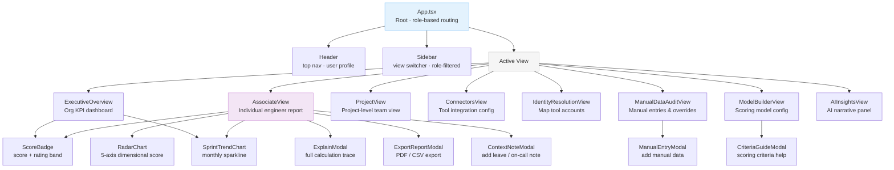
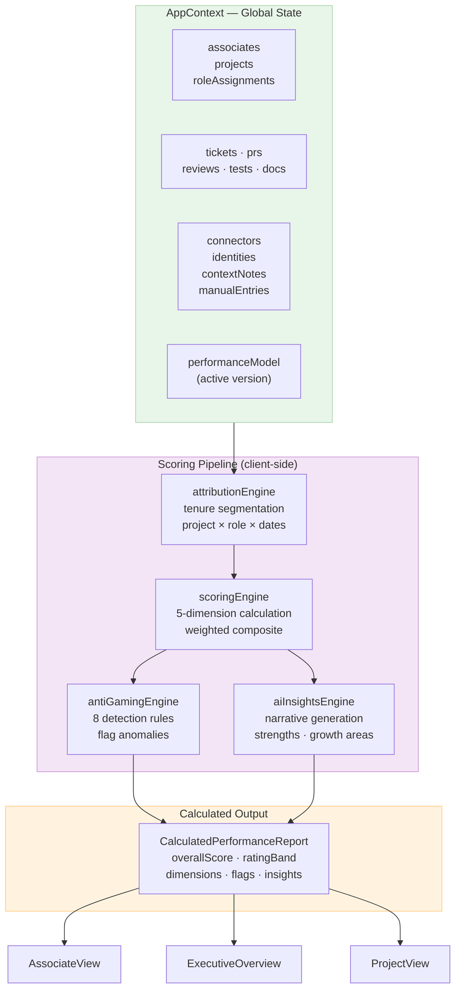
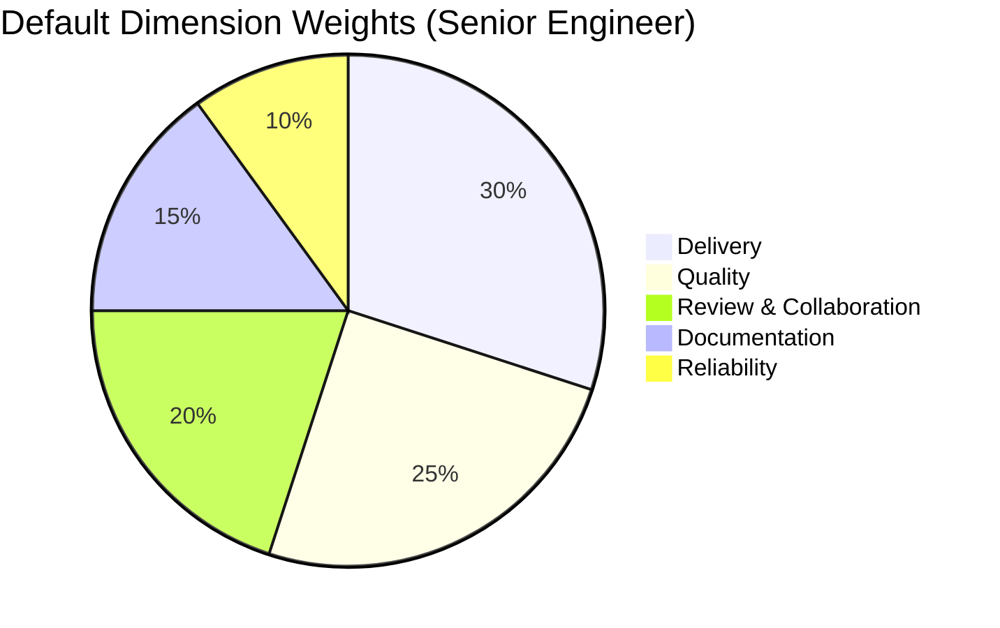
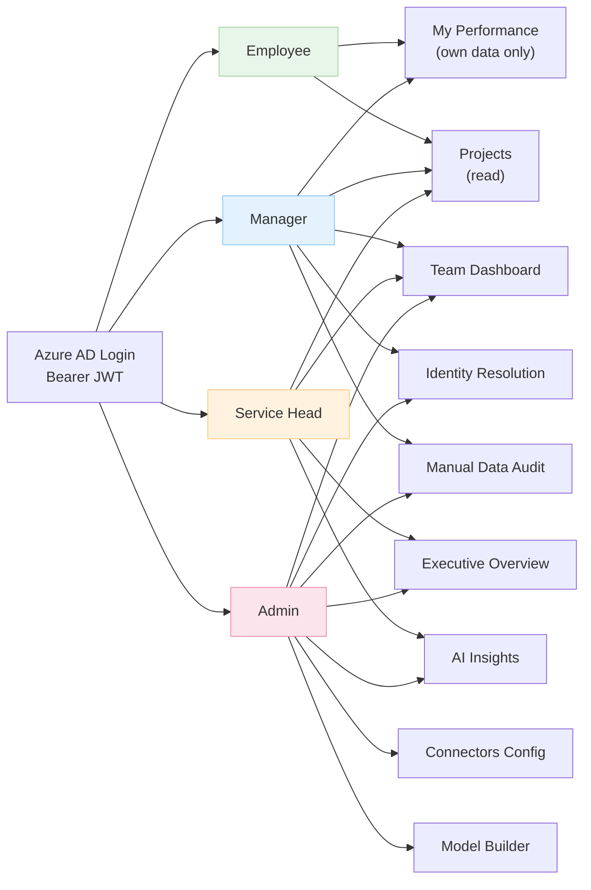

# Frontend Architecture — Perf Insight UI (`psiog-engineering-insights`)

## Overview

The Perf Insight frontend is a **React 18 + TypeScript + Vite** single-page application. It provides role-based dashboard views for engineers, managers, and delivery heads. All scoring logic runs **client-side** for real-time interactive previews, mirroring the backend algorithm exactly.

---

## Technology Stack

| Concern | Technology |
|---------|-----------|
| Framework | React 18 |
| Language | TypeScript 5.6 |
| Build Tool | Vite 5.4 |
| Icons | Lucide React |
| Styling | Tailwind CSS |
| State | React Context API (`AppContext`) |
| Auth | Azure AD Bearer JWT |

---

## Application Structure

```
src/
├── main.tsx                    Entry point
├── App.tsx                     Root router, role-based view switching
├── index.css
├── types/index.ts              All TypeScript interfaces
├── context/AppContext.tsx      Global state (single source of truth)
├── services/
│   ├── scoringEngine.ts        5-dimension weighted scoring
│   ├── antiGamingEngine.ts     8 anomaly/gaming detection rules
│   ├── attributionEngine.ts    Tenure-based attribution (mid-period moves)
│   ├── identityResolution.ts   Tool account → associate mapping
│   ├── aiInsightsEngine.ts     AI narrative generation
│   ├── connectorService.ts     Tool connector management
│   └── syncService.ts          Backend sync coordination
├── data/
│   ├── defaultModels.ts        Seed performance model configs
│   └── initialSeedData.ts      Demo dataset
└── components/
    ├── layout/Header.tsx
    ├── layout/Sidebar.tsx
    ├── views/                  8 main views (see below)
    └── common/                 Shared UI components
```

---

## Component Tree



---

## Data Flow



---

## State Management

`AppContext` is the **single source of truth**. No component maintains its own copy of shared data.

```mermaid
flowchart LR
    subgraph State["AppContext State Slices"]
        direction TB
        S1["currentUser\nrole · associateId"]
        S2["associates · projects\nroleAssignments"]
        S3["identities\nconnectors · syncLogs"]
        S4["contextNotes\nmanualEntries"]
        S5["tickets · prs · reviews\ntests · docs"]
        S6["performanceModel"]
        S7["calculatedReports\ncached per associate"]
        S8["currentView\nselectedAssociateId\nselectedProjectId"]
    end

    subgraph Consumers["Consuming Components"]
        C1["AssociateView"]
        C2["ExecutiveOverview"]
        C3["ConnectorsView"]
        C4["ModelBuilderView"]
        C5["IdentityResolutionView"]
    end

    State -->|"useContext(AppContext)"| Consumers
```



---

## Scoring Dimensions (client-side)



Weights are configurable per persona in `ModelBuilderView`. See [scoring-engine.md](scoring-engine.md) for the full algorithm.

---

## Role-Based View Access



---

## Running Locally

```bash
cd psiog-insights-app/scratch/psiog-engineering-insights
npm install
npm run dev       # http://localhost:5173
npm run build     # verify 0 TypeScript errors
npm run preview   # preview production build
```

Backend expected at `http://localhost:8080`. See the backend repo for setup.
