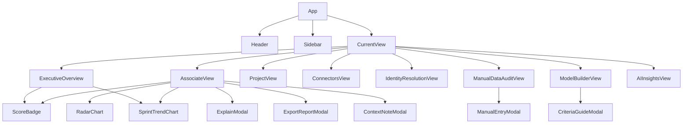

# Frontend Architecture — Perf Insight UI (`psiog-engineering-insights`)

## Overview

The Perf Insight frontend is a **React 18 + TypeScript + Vite** single-page application. It provides role-based dashboard views for engineers (viewing their own performance), managers (managing team data), and delivery heads (executive overview). All scoring logic runs **client-side** using the same algorithm as the backend, enabling explainable, real-time score previews before any backend sync.

---

## Technology Stack

| Concern | Technology |
|---------|-----------|
| Framework | React 18 |
| Language | TypeScript 5.6 |
| Build Tool | Vite 5.4 |
| Icons | Lucide React |
| Styling | Tailwind CSS (utility-first) |
| State Management | React Context API (`AppContext`) |
| Auth | Azure AD Bearer JWT (passed to backend) |

---

## Application Structure

```
src/
├── main.tsx                    Entry point
├── App.tsx                     Root router, role-based view switching
├── index.css                   Global styles + Tailwind imports
│
├── types/
│   └── index.ts                All TypeScript interfaces and type aliases
│
├── context/
│   └── AppContext.tsx           Global state: org data, connectors, scores, current user
│
├── services/
│   ├── scoringEngine.ts        5-dimension weighted scoring algorithm (client-side)
│   ├── antiGamingEngine.ts     8 deterministic anomaly/gaming detection rules
│   ├── attributionEngine.ts    Tenure-based activity attribution (mid-period moves)
│   ├── identityResolution.ts   Tool account → associate identity mapping logic
│   ├── aiInsightsEngine.ts     AI narrative generation (connects to backend LLM endpoint)
│   ├── connectorService.ts     Tool connector configuration and status management
│   └── syncService.ts          Data sync coordination with backend
│
├── data/
│   ├── defaultModels.ts        Seed performance model configurations
│   └── initialSeedData.ts      Demo dataset for local development
│
└── components/
    ├── layout/
    │   ├── Header.tsx          Top navigation bar: logo, user profile, notifications
    │   └── Sidebar.tsx         Left navigation: view switcher, role-filtered links
    │
    ├── views/
    │   ├── ExecutiveOverview.tsx     Org-level KPI dashboard for delivery heads
    │   ├── AssociateView.tsx         Individual engineer performance detail
    │   ├── ProjectView.tsx           Project-level team performance
    │   ├── ConnectorsView.tsx        Tool integration configuration and sync status
    │   ├── IdentityResolutionView.tsx  Map tool accounts to associates
    │   ├── ManualDataAuditView.tsx   Review and add manual data entries
    │   ├── ModelBuilderView.tsx      Configure scoring model weights and benchmarks
    │   └── AIInsightsView.tsx        AI-generated narrative insights panel
    │
    └── common/
        ├── ContextNoteModal.tsx    Add/edit manager context notes (leave, on-call, etc.)
        ├── CriteriaGuideModal.tsx  Scoring criteria explanation dialog
        ├── ExplainModal.tsx        Drill-down score explanation with calculation trace
        ├── ExportReportModal.tsx   Export performance report as PDF or CSV
        ├── ManualEntryModal.tsx    Form to add manual data entries
        ├── RadarChart.tsx          5-axis radar chart for dimensional score visualisation
        ├── ScoreBadge.tsx          Colour-coded score badge with rating band label
        └── SprintTrendChart.tsx    Monthly score trend sparkline chart
```

---

## Component Architecture



---

## State Management (`AppContext`)

All global application state lives in `src/context/AppContext.tsx`. The context is the single source of truth for:

| State Slice | Description |
|-------------|-------------|
| `currentUser` | Authenticated user's associate record and role |
| `associates` | All associate profiles visible to the current user |
| `projects` | All projects |
| `roleAssignments` | Effective-dated project role assignments |
| `identities` | Tool account identity mappings |
| `connectors` | Tool connector configurations and sync status |
| `syncLogs` | Sync execution history |
| `contextNotes` | Manager context notes |
| `manualEntries` | Manual data entries |
| `tickets` | Canonical Jira / ADO ticket activities |
| `prs` | GitHub pull request activities |
| `reviews` | Code review activities |
| `tests` | TestRail test execution activities |
| `docs` | SharePoint document activities |
| `performanceModel` | Active scoring model version |
| `calculatedReports` | Cached `CalculatedPerformanceReport` per associate |
| `currentView` | Active view key for navigation |
| `selectedAssociateId` | Currently inspected associate |
| `selectedProjectId` | Currently inspected project |

---

## Data Flow

```
AppContext (global state)
    │
    ▼
scoringEngine.calculateAssociatePerformanceReport()
    │  Inputs: associate, period, model, roleAssignments, projects, identities,
    │           contextNotes, manualEntries, tickets, prs, reviews, tests, docs
    │
    ├── attributionEngine.calculateTenureSegments()
    │       → Splits activity across project × role × date segments
    │
    ├── identityResolution.resolveToolAccountToAssociateId()
    │       → Maps tool handles to associate IDs
    │
    ├── Dimension Scoring (per segment):
    │   ├── Delivery:      story points + merged PRs vs benchmark, normalized by effective days
    │   ├── Quality:       bug leak rate + rework bounce count
    │   ├── Review:        substantive reviews (filters superficial "LGTM" reviews)
    │   ├── Documentation: SharePoint docs count + word count vs benchmark
    │   └── Reliability:   on-call duty, deployment stability (inferred from context notes)
    │
    ├── antiGamingEngine.detectAntiGamingPatterns()
    │       → Checks 8 rules; returns AntiGamingFlag[] for display in report
    │
    └── CalculatedPerformanceReport
            → Stored in AppContext.calculatedReports
            → Rendered by AssociateView, ExecutiveOverview
```

---

## View Descriptions

### ExecutiveOverview
Org-wide KPI dashboard for delivery heads and service heads. Shows:
- Fleet health score across all projects
- Score distribution (rating band breakdown)
- Top performers and growth-priority associates
- Project-level health trends
- Active anti-gaming flag count

### AssociateView
Individual engineer's performance profile. Shows:
- Radar chart of 5 dimensional scores
- Overall score badge with rating band
- Sprint-level trend chart
- Dimensional breakdown with raw metrics and benchmark comparisons
- Context adjustments applied (leave, on-call days)
- AI-generated narrative (executive summary, strengths, growth areas)
- Anti-gaming flags (if any)
- Drill-down explanation via `ExplainModal`
- Export to PDF/CSV via `ExportReportModal`

### ProjectView
Team-level performance for a single project. Shows:
- All associates on the project with their scores
- Offering-specific benchmark comparisons
- Project health score
- Activity breakdown by tool source

### ConnectorsView
Tool integration management. Shows:
- Connected tools (JIRA, GitHub, Azure DevOps, TestRail, SharePoint)
- Connector status (Connected / Error / Mock Active / Syncing)
- Last sync timestamp and record counts
- Field mapping configuration
- Sync trigger controls

### IdentityResolutionView
Cross-tool identity management. Shows:
- Unmatched tool accounts (handles without a linked associate)
- Fuzzy match suggestions with confidence scores
- Manual link/unlink controls

### ManualDataAuditView
Manual data entry oversight. Shows:
- All manual entries and overrides with requester and reason
- Add new manual entry form via `ManualEntryModal`
- Override trail (original value preserved)

### ModelBuilderView
Scoring model configuration. Shows:
- Dimension weight sliders by persona (Engineer / Senior Engineer / Lead)
- Offering-specific benchmark targets
- Anti-gaming rule thresholds
- Model version history
- Model documentation and rationale editor

### AIInsightsView
AI narrative insights panel. Shows:
- AI-generated summaries for selected associate/period
- Narrative sections: executive summary, strengths, growth areas, tenure shift
- Evidence grounding (links back to computed metrics)

---

## Scoring Engine Summary

The client-side scoring engine (`scoringEngine.ts`) mirrors the backend `ScoringService`. See [scoring-engine.md](scoring-engine.md) for the full algorithm documentation.

**5 Dimensions:**

| Dimension | Default Weight | Key Metrics |
|-----------|---------------|-------------|
| Delivery | 30% | Story points delivered, merged PRs |
| Quality | 25% | Bug leak rate, rework bounce count |
| Review | 20% | Substantive code reviews (superficial filtered) |
| Documentation | 15% | SharePoint docs count, word count |
| Reliability | 10% | On-call duty days, deployment stability |

Weights are configurable per persona in `ModelBuilderView` and stored in `PerformanceModelVersion`.

---

## Key Type Definitions

All types are in `src/types/index.ts`. Key interfaces:

| Type | Description |
|------|-------------|
| `Associate` | Employee profile |
| `Project` | Delivery project |
| `ProjectRoleAssignment` | Effective-dated project ↔ associate ↔ role link |
| `ToolAccountIdentity` | Tool account ↔ associate mapping |
| `ManagerContextNote` | Leave/on-call/mentorship events that adjust scoring baseline |
| `ManualDataEntry` | First-class manual data (not an override) |
| `JiraTicket` | JIRA / ADO work item |
| `GitPullRequest` | GitHub pull request |
| `GitReview` | GitHub code review |
| `TestExecution` | TestRail test run result |
| `SharePointDocument` | SharePoint document |
| `PerformanceModelVersion` | Versioned scoring model with weights and benchmarks |
| `CalculatedPerformanceReport` | Full scored output for one associate × period |
| `AntiGamingFlag` | Detected pattern anomaly |
| `ConnectorConfig` | Tool integration configuration |
| `SyncLogEntry` | Sync execution history record |

---

## Running Locally

```bash
cd psiog-insights-app   # root of this repository
npm install
npm run dev             # starts Vite dev server at http://localhost:5173
```

For a production build:
```bash
npm run build           # outputs to dist/
npm run preview         # preview the built app
```

**Environment:** The app targets the backend at `http://localhost:8080` by default. Configure the API base URL in `vite.config.ts` or via environment variables.
